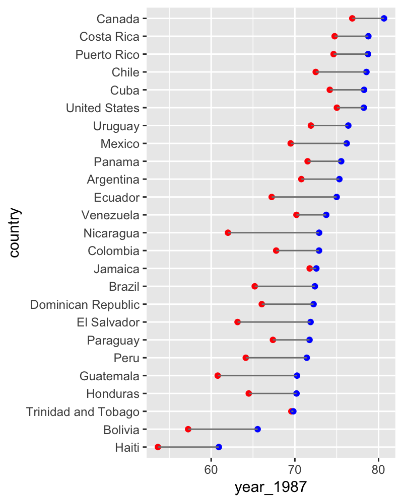
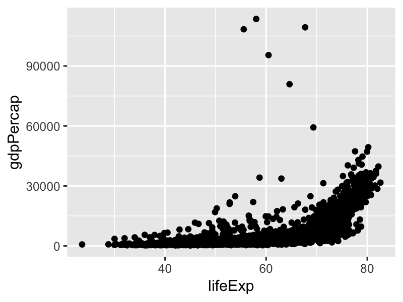
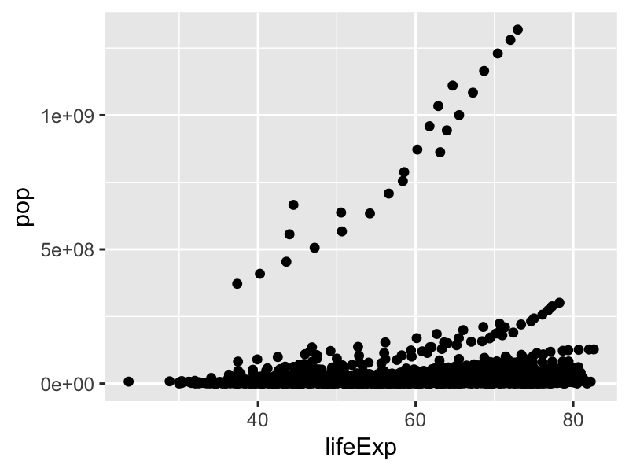

ggplot2 Extensions
========================================================
author: Matt Mills
date: 06/20/18
width: 1600
height: 1000


Agenda
========================================================

- *Brief* overview of ggplot2 + extensions
- Resources for extensions
- Some existing extensions
- ~~Writing your own extension~~

What is ggplot2?
========================================================

Package for **G**rammer of **G**raphics

> You provide the data, tell ggplot2 how to map variables to aesthetics, what graphical primitives to use, and it takes care of the details.

What is ggplot2?
===


```r
library(ggplot2)
library(dplyr)
library(gapminder)

pop_by_year <- gapminder %>%
  filter(country == "United States") %>%
  ggplot(aes(x = year, y = pop, group = country)) +
  geom_line()

pop_by_year
```


Advantages of using ggplot
===

Completely customizable aesthetics


```r
pop_by_year +
  labs(x = "Year", y = "Population", title = "US Population by Year") +
  scale_y_continuous(labels = function(x) paste0(round(x / 1e6), " mil")) +
  theme(axis.text.x = element_text(face = "bold"),
        panel.background = element_blank(),
        panel.grid = element_line(color = "blue"))
```


Advantages of using ggplot: continued
===

Easy visualization of data


```r
gapminder %>%
  filter(continent == "Americas") %>%
  ggplot(aes(x = year, y = pop, group = country)) +
  geom_line() +
  facet_wrap(~country, nrow = 3) +
  scale_y_log10()
```


Resources for learning ggplot2
===

- https://ggplot2.tidyverse.org/
- http://r4ds.had.co.nz/data-visualisation.html
- http://www.cookbook-r.com/Graphs/
- https://www.rstudio.com/wp-content/uploads/2016/11/ggplot2-cheatsheet-2.1.pdf

ggplot2 extensions
===

- What if ggplot2 doesn't have the `geom` you want?
- **extensions** allow you to write your own `geom`
  + share with others in an R package
- http://www.ggplot2-exts.org/

ggplot2 extensions: example
===
left: 60%


```r
library(tidyr)
life_exp_8707 <- gapminder %>%
  filter(continent == "Americas", year == 1987 | year == 2007) %>%
  select(-pop, -gdpPercap) %>%
  spread(year, lifeExp, sep = "_") %>%
  mutate(country = reorder(country, year_2007))

life_exp_8707 %>%
  ggplot() +
  geom_point(aes(y = country, x = year_1987), color = "red") +
  geom_point(aes(y = country, x = year_2007), color = "blue") +
  geom_segment(aes(y = country, yend = country, x = year_1987, xend = year_2007), color = "grey50")
```

***



ggplot2 extensions: dumbell
===


```r
life_exp_8707 %>%
  ggplot(aes(y = country, x = year_1987, xend = year_2007)) +
  ggalt::geom_dumbbell(colour_x = "red", colour_xend = "blue", size_x = 2, size_xend = 2)
```


Popular extensions
===

- patchwork
- gganimate
- ggridges
- ggrepel
- ggExtra
- gghighlight
- ggthemes
- ggiraph

patchwork
===

Combine plots together into one image

> The goal of patchwork is to make it ridiculously simple to combine separate ggplots into the same graphic. As such it tries to solve the same problem as `gridExtra::grid.arrange()` and `cowplot::plot_grid` but using an API that incites exploration and iteration.

https://github.com/thomasp85/patchwork

patchwork: Motivating Example
===


```r
gdp_plot
```



***

```r
pop_plot
```



patchwork: Continued
===

```r
gdp_plot + pop_plot
```


patchwork: Continued
===


```r
# gdp_plot + pop_plot - life_dist_plot + plot_layout(ncol = 1)
(gdp_plot | pop_plot) / life_dist_plot
```


patchwork: Continued
===


```r
gdp_plot + pop_plot - life_dist_plot + plot_layout(ncol = 1, heights = c(2, 1)) & theme_bw()
```


gganimate
===

Turn plots into animated gifs

> The core of the approach is to treat "frame" (as in, the time point within an animation) as another aesthetic, just like x, y, size, color, or so on. Thus, a variable in your data can be mapped to frame just as others are mapped to x or y.

https://github.com/dgrtwo/gganimate

gganimate: example
===


```r
library(gganimate)
year_plot <- gapminder %>%
  ggplot(aes(gdpPercap, lifeExp, size = pop, color = continent, frame = year)) +
  geom_point() +
  scale_x_log10() +
  theme_bw()

gganimate(year_plot, filename = "~/Documents/Presentations/r_users/year_plot.gif")
```


gganimate: House Keeping
===
- No longer a single ggplot image
  + doesn't play nice with markdown
- To make smooth transitions between your data use the `tweenr` package
- package is undergoing a total rewrite
  + `aes(frame = ...)` is going away at some point
  
ggridges
===


https://blogs.scientificamerican.com/sa-visual/pop-culture-pulsar-origin-story-of-joy-division-s-unknown-pleasures-album-cover-video/

ggridges
===

Stacked density charts

> Ridgeline plots are partially overlapping line plots that create the impression of a mountain range. They can be quite useful for visualizing changes in distributions over time or space.

https://github.com/clauswilke/ggridges

ggridges: example
===


```r
library(ggridges)
gapminder %>%
  ggplot(aes(x = gdpPercap, y = continent)) +
  ggridges::geom_density_ridges2() +
  scale_x_log10()
```


ggridges: Continued
===


```r
gapminder %>%
  ggplot(aes(x = gdpPercap, y = continent, fill = ..x..)) +
  ggridges::geom_density_ridges_gradient(scale = 3, rel_min_height = .01) +
  scale_fill_viridis_c() +
  scale_x_log10()
```


ggridges: raincloud plots
===


```r
gapminder %>%
  ggplot(aes(x = gdpPercap, y = continent, fill = ..x..)) +
  ggridges::geom_density_ridges_gradient(scale = .9, rel_min_height = .01, position = position_raincloud(), jittered_points = T) +
  scale_fill_viridis_c() +
  scale_x_log10()
```


ggrepel
===

Prevents text labels from overlapping

> ggrepel provides geoms for ggplot2 to repel overlapping text labels:

https://github.com/slowkow/ggrepel

ggrepel: example
===


```r
library(ggrepel)

gapminder %>%
  filter(year == 2007, continent == "Americas") %>%
  ggplot(aes(x = gdpPercap, y = lifeExp)) +
  geom_point() +
  geom_text(aes(label = country))
```


ggrepel: example
===


```r
library(ggrepel)

gapminder %>%
  filter(year == 2007, continent == "Americas") %>%
  ggplot(aes(x = gdpPercap, y = lifeExp)) +
  geom_point() +
  geom_text_repel(aes(label = country))
```


ggextra
===

Add marginal density plots to scatter plots


https://github.com/daattali/ggExtra

ggExtra: example
===


```r
p <- ggExtra::ggMarginal(life_vs_gdp_plot)

grid::grid.newpage()
grid::grid.draw(p)
```


ggExtra: Continued
===


```r
p2 <- gapminder %>%
  ggplot(aes(x = gdpPercap, y = lifeExp, color = continent)) +
  geom_point() +
  scale_x_log10()

p2 <- ggExtra::ggMarginal(p2, groupFill = T)

grid::grid.newpage()
grid::grid.draw(p2)
```


gghighlight
===

Highlight relevant portions of your data 

https://github.com/yutannihilation/gghighlight
- The package on `cran` is old


```r
gapminder %>%
  ggplot(aes(x = year, y = gdpPercap, group = country)) +
  geom_line() +
  scale_y_log10()
```


gghighlight: example
===


```r
library(gghighlight)

gapminder %>%
  ggplot(aes(x = year, y = gdpPercap, group = country, color = country)) +
  geom_line() +
  scale_y_log10() +
  gghighlight(country %in% c("United States", "Canada", "Mexico"), use_group_by = F)
```


gghighlight: continued
===


```r
gapminder %>%
  filter(continent == "Americas") %>%
  ggplot(aes(x = year, y = gdpPercap, group = country, color = country)) +
  geom_line() +
  scale_y_log10() +
  facet_wrap(~country, nrow = 3) +
  gghighlight(T, use_group_by = F, use_direct_label = F) +
  scale_color_discrete(guide = F)
```


ggthemes
===

Provide themes for ggplots

https://cran.r-project.org/web/packages/ggthemes/vignettes/ggthemes.html

ggiraph
===

http://davidgohel.github.io/ggiraph/articles/offcran/using_ggiraph.html

Writing your own extension
===

https://ggplot2.tidyverse.org/articles/extending-ggplot2.html

Will need a basic understanding of **O**bject **O**riented programming


```r
gdp_plot
```


```r
class(gdp_plot)
```

```
[1] "gg"     "ggplot"
```

Geoms and Stats
===


```r
?ggplot2::Geom
```

> All geom_ functions (like geom_point) return a layer that contains a Geom object (like GeomPoint). The Geom* object is responsible for rendering the data in the plot.

- `geom_point` => `GeomPoint` object
- calling the function tells ggplot what data to use to create the object

To make your own extension you'll need to create your own `Geom` object (or `Stat` object if creating a stat layer)

ggproto
===

- `ggproto` is the sytem of OO that ggplot uses. 
- Different object types for different parts
  + `Geom`
  + `Stat`
  + `Position` 
  + `Scale`
  + `Coord`
  + `Facets`
- Each type has its own methods you must customize (override)

Custom Stat
===

- We need to tell ggplot what calculation to run and what geom to plot once we get the results


```r
?Stat
```

```r
StatMiddle <- ggproto("StatMiddle", Stat,
  compute_group = function(data, scales) {
    xmed <- median(data$x)
    ymed <- median(data$y)
    
    data.frame(x = xmed, y = ymed)
  },
  
  required_aes = c("x", "y")
)
```

Custom Stat: Continued
===

Now we have a calculation that *does* something, we need to be able to call it like `stat_smooth`


```r
stat_middle <- function(mapping = NULL, data = NULL, geom = "point",
                       position = "identity", na.rm = FALSE, show.legend = NA, 
                       inherit.aes = TRUE, ...) {
  ggplot2::layer(
    stat = StatMiddle, data = data, mapping = mapping, geom = geom, 
    position = position, show.legend = show.legend, inherit.aes = inherit.aes,
    params = list(na.rm = na.rm, ...)
  )
}
```

Custom Stat: example
===


```r
gapminder %>%
  ggplot(aes(x = lifeExp, y = gdpPercap)) + 
  geom_point() +
  scale_y_log10() +
  stat_middle(color = "red", size = 2)
```


Custom Stat: example
===


```r
gapminder %>%
  ggplot(aes(x = lifeExp, y = gdpPercap)) + 
  geom_point() +
  scale_y_log10() +
  stat_middle(aes(color = continent), size = 2)
```


Questions?
===

https://github.com/AtlantaRUsers/Meetups


